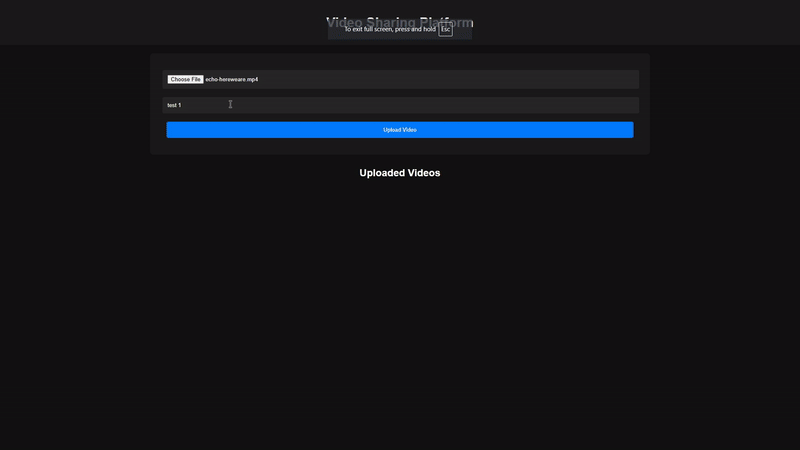

# Video Sharing Platform 🎥


[](https://nodejs.org/)
[](https://expressjs.com/)
[](LICENSE)

Video Sharing Platform is a web-based application that allows users to upload and share videos with others. This platform provides a seamless experience for video uploading, playback, and sharing through a user-friendly interface.

---

## Features ✨

- **Video Uploading**: Easily upload videos with a title and get a shareable link.
- **Thumbnail Generation**: Automatically generates thumbnails for uploaded videos.
- **Playback Controls**: Custom video player with controls for playback speed, volume, and progress.
- **Responsive Design**: Works well on both desktop and mobile devices.
- **Size Limit**: Max size limit Variable for uploaded vidoes in server.js
- **Time Upload Limit**: Variable For Max Amount Of Videos Per Hour in server.js

## Demo



## Installation 🛠️

1. Clone this repository:
    ```bash
    git clone https://github.com/noobgokf1/Video-Sharing-Plaform.git
    ```
2. Change directory into the project folder:
    ```bash
    cd Video-Sharing-Plaform
    ```
3. Install dependencies:
    ```bash
    npm install
    ```
4. Change directory into the server folder
    ```bash
    cd server
    ```
5. Start the server:
    ```bash
    node server.js
    ```

## Usage 📖

1. **Upload Videos**:
   - Navigate to the home page and use the upload form to select a video file and enter a title.
   - Click "Upload Video" to begin the upload process.

2. **View Uploaded Videos**:
   - After uploading, the video link will be displayed for sharing.
   - Visit the list of uploaded videos to view all available videos.

3. **Watch Videos**:
   - Click on any video thumbnail to open the video player and view the video.

## Code Overview 🧩

This project includes:
- **Server Setup**: An Express server to handle video uploads and serve files.
- **Video Management**: Logic for handling video uploads, thumbnail generation, and metadata storage.
- **Frontend Interface**: HTML, CSS, and JavaScript to provide a responsive and interactive user experience.

### Key Functions
- `uploadVideo()`: Handles the video upload process and generates thumbnails.
- `getVideos()`: Retrieves a list of uploaded videos and their metadata.
- `serveVideo()`: Serves individual video files for playback.

## Folder Structure 📂
```plaintext
.
├──assets/                        # Images For Read Me File Etc.
├── public/                       # Public assets (HTML, CSS, JS)
│   ├── index.html                # Main page for video uploads
│   ├── video.html                # Video player page
│   ├── copy.png                  # Icon for copy button
│   ├── videoMetadata.json        # Metadata for uploaded videos
│   ├── style.css                 # Styles for the application
│   ├── video.css                 # Styles for the video player
│   ├── script.js                 # Logic for uploading videos
│   ├── video.js                  # Logic for video playback
│   └── videos/                   # Folder For Uplaoded Videos
│        ├── thumbnails/          # Generated video thumbnails
│        └── [uploaded videos]    
├── server/                       # Server Files
│    ├── server.js                # Node.js server code
└── README.md                     # Project documentation
```
### Contributing 🤝
Contributions are welcome! Please feel free to submit issues, fork the repository, and make a pull request.

### License 📝
This project is licensed under the MIT License - see the LICENSE file for details.

